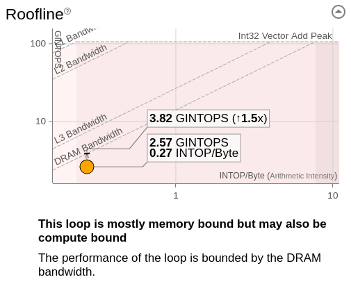
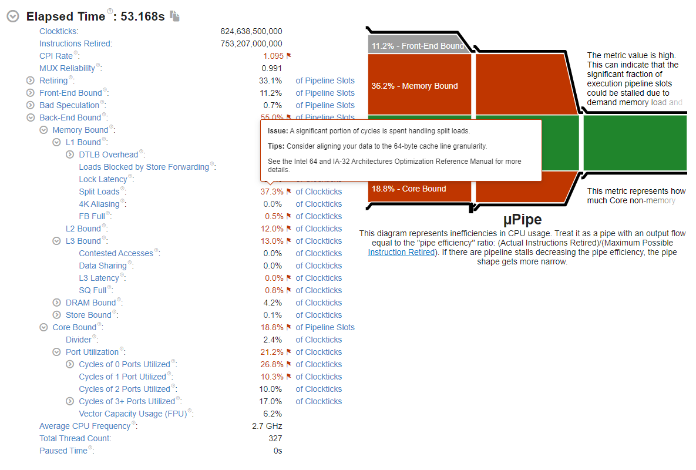

# Substring Search Benchmark

A collection of different substring search algorithms implemented using SIMD compiler intrinsics (on x86 and ARM). They have similar asymptotic complexity, but vary a lot in terms of real world results. The solutions may not be very elegant, but they are very short and were published for educational purposes.

## Algorithms

There is a lot of variance between different runs. 
The haystack size was `= 512M Bytes`. 
The needle size was `10 Bytes`. 

| Benchmark                |   IoT    |  Laptop  |  Server   |
| :----------------------- | :------: | :------: | :-------: |
| Python                   |  4 MB/s  | 14 MB/s  |  11 MB/s  |
| Cpp: `std::string::find` | 560 MB/s | 1,2 GB/s | 1,3 GB/s  |
| Cpp: `av::naive_t`       | 520 MB/s | 1,0 GB/s | 900 MB/s  |
| Cpp: `av::prefixed_t`    |  2 GB/s  | 3,3 GB/s | 3,5 GB/s  |
| Cpp: SIMD-accelerated    | 4,3 Gb/s | 12 GB/s  | 12.1 GB/s |

The last row can be further expanded to show how minor changes to code (such as the order of the same instructions) may affect final performance.

| Benchmark                  |   IoT    |  Laptop   |  Server   |
| :------------------------- | :------: | :-------: | :-------: |
| `av::prefixed_avx2_t`      |          | 8,5 GB/s  | 10,5 GB/s |
| `av::hybrid_avx2_t`        |          | 9,1 GB/s  | 9,1 GB/s  |
| `av::speculative_avx2_t`   |          | 12,0 GB/s | 9,9 GB/s  |
| `av::speculative_avx512_t` |          |           | 9,9 GB/s  |
| `av::speculative_neon_t`   | 4,3 Gb/s |           |           |

Furthermore, if we disable frequency scaling and load al the cores we can measure the average performance per core on differen platforms.

| Benchmark        |    IoT     |    IoT     |     IoT      |   Laptop    |    Server    |
| :--------------- | :--------: | :--------: | :----------: | :---------: | :----------: |
| ISA              |    ARM     |    ARM     |     ARM      |     x86     |     x86      |
| Process          | 12 nm TSMC | 12 nm TSMC |  12 nm TSMC  | 14 nm Intel | 14 nm Intel  |
| Cores            |     2      |     4      |      8       |      8      |      22      |
| TDP/Core         |    2 W     |    1 W     |    0,5 W     |    5,6W     |    6,3 W     |
| CPU Frequency    |  2,1 GHz   |  1,7 GHz   |   1,2 GHz    |   2,3 GHz   |   2,1 GHz    |
| Performance      |  6,6 Gb/s  |  10 GB/s   |  33,6 GB/s   |   87 GB/s   | **231 GB/s** |
| Performance/Core |  3,3 Gb/s  |  2,5 GB/s  |   2,1 GB/s   | **11 GB/s** |  10,5 GB/s   |
| Bytes/Joule      |  1,6 Gb/J  |  2,5 GB/J  | **4,2 GB/J** |   2 GB/J    |   1,6 GB/J   |

Devices used:

* IoT:
  * Model: Nvidia Jetson AGX.
  * CPU: 8-core 64-bit [Carmel](https://en.wikipedia.org/wiki/Project_Denver) Arm v8.2.
  * Max TDP: 4W / 8 cores = 0.5 W/core.
  * Year: 2018.
  * ARMv8 features: `fp asimd evtstrm aes pmull sha1 sha2 crc32 atomics fphp asimdhp`.

* Laptop:
  * Model: Apple MacBook Pro 16".
  * CPU: 8-core [Intel Core i9-9880H](https://ark.intel.com/content/www/us/en/ark/products/192987/intel-core-i9-9880h-processor-16m-cache-up-to-4-80-ghz.html).
  * Max TDP: 45W / 8 cores = 5.6 W/core.
  * Year: 2019.
  * No AVX-512 support.

* Server:
  * CPU: 2x 22-core [Intel Xeon Gold 6152](https://ark.intel.com/content/www/us/en/ark/products/120491/intel-xeon-gold-6152-processor-30-25m-cache-2-10-ghz.html).
  * Max TDP: 140W / 22 cores = 6.5 W/core.
  * Year: 2017.
  * Has AVX-512 support.

## Analysis

Using Intel Advisor one can see, that the `av::speculative_avx2_t` reaches the hardware limit - it's mostly memory-bound, but may also be compute-bound.

The biggest performance killer are split-loads from L1 cache. They can't be optimized due to the nature of the task. Duplicating the `haystack` 4x times at different offsets into seprate aligned memory banks may potentially help in single-core setting, but copying data takes more time.

---

This material was presented at the CppRussia 2020 conference: [talk description](https://cppconf-piter.ru/en/2020/spb/talks/23g3egeumhe3p4fd66pbar/).
If you are interested in high-performance software and algorithm design - check out [Unum](https://unum.xyz).
The `Unum.DB` is our in-house database developed with similar tricks and it's orders of magniture faster than the alternatives in both read and write operations!
